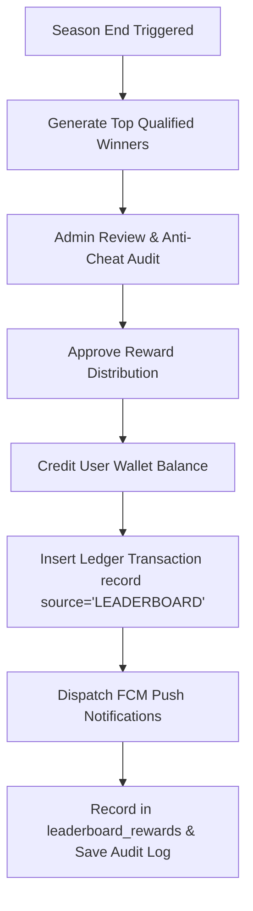

# 🏆 Leaderboard Module Documentation (Admin + User)

The **Leaderboard Module** for Rewardverse / StuEarn is a complete gamification system featuring both **Earnings Leaderboards** and **Referral Leaderboards** across Daily, Weekly, Monthly, and All-Time timeframes.

---

## 1. Dynamic Prize Pool Architecture ⭐

Rather than relying on static prize pools, this module supports **Dynamic Growing Prize Pools** that expand as user activity and qualified participation grow across the platform.

### Dynamic Pool Calculation Formula
```text
Dynamic Prize Pool = MIN( Base Prize Pool + ( Qualified Participants × Growth Rate per User ), Maximum Pool Cap )
```

#### Example Configuration
- **Base Prize Pool**: 25,000 Coins
- **Growth Rate per Participant**: 10 Coins / qualified user
- **Maximum Prize Pool Cap**: 100,000 Coins
- **Current Qualified Participants**: 1,842 Users

```text
Current Pool = MIN( 25,000 + ( 1,842 × 10 ), 100,000 ) = 43,420 Coins
```

This live calculated prize pool is served to mobile app home banners and admin dashboards in real time.

---

## 2. Leaderboard Structure & Types

### 💰 Earnings Leaderboard
Tracks coins earned through offers, surveys, tasks, spin & win, and streak check-ins.
- **Daily Earnings**
- **Weekly Earnings**
- **Monthly Earnings**
- **All-Time Earnings**

### 👥 Referral Leaderboard
Tracks valid successful referrals and referral income.
- **Daily Referrals**
- **Weekly Referrals**
- **Monthly Referrals**
- **All-Time Referrals**

---

## 3. Database Design

```sql
-- 1. Leaderboards Table
CREATE TABLE IF NOT EXISTS leaderboards (
  id CHAR(36) PRIMARY KEY,
  name VARCHAR(255) NOT NULL,
  type VARCHAR(50) NOT NULL DEFAULT 'EARNINGS', -- EARNINGS, REFERRAL
  period VARCHAR(50) NOT NULL DEFAULT 'DAILY',   -- DAILY, WEEKLY, MONTHLY, ALL_TIME
  minimum_score DECIMAL(10, 2) DEFAULT 0.00,
  minimum_referrals INT DEFAULT 0,
  reward_pool DECIMAL(10, 2) DEFAULT 0.00,
  dynamic_pool_enabled BOOLEAN DEFAULT TRUE,
  pool_growth_per_user DECIMAL(10, 2) DEFAULT 10.00,
  max_pool_cap DECIMAL(10, 2) DEFAULT 100000.00,
  max_winners INT DEFAULT 20,
  start_date DATETIME NULL,
  end_date DATETIME NULL,
  auto_reward BOOLEAN DEFAULT FALSE,
  show_on_home BOOLEAN DEFAULT TRUE,
  status VARCHAR(50) DEFAULT 'ACTIVE',
  created_at TIMESTAMP DEFAULT CURRENT_TIMESTAMP
);

-- 2. Leaderboard Entries Table
CREATE TABLE IF NOT EXISTS leaderboard_entries (
  id CHAR(36) PRIMARY KEY,
  leaderboard_id CHAR(36) NOT NULL,
  user_id CHAR(36) NOT NULL,
  score DECIMAL(10, 2) DEFAULT 0.00,
  referrals_count INT DEFAULT 0,
  rank INT DEFAULT 0,
  qualified BOOLEAN DEFAULT TRUE,
  is_disqualified BOOLEAN DEFAULT FALSE,
  disqualify_reason TEXT NULL,
  is_hidden BOOLEAN DEFAULT FALSE,
  updated_at TIMESTAMP DEFAULT CURRENT_TIMESTAMP ON UPDATE CURRENT_TIMESTAMP,
  UNIQUE KEY unique_leaderboard_user (leaderboard_id, user_id),
  FOREIGN KEY (user_id) REFERENCES users(id) ON DELETE CASCADE
);

-- 3. Leaderboard Reward Tiers Table
CREATE TABLE IF NOT EXISTS leaderboard_reward_tiers (
  id CHAR(36) PRIMARY KEY,
  leaderboard_id CHAR(36) NOT NULL,
  start_rank INT NOT NULL,
  end_rank INT NOT NULL,
  reward_coins DECIMAL(10, 2) NOT NULL,
  created_at TIMESTAMP DEFAULT CURRENT_TIMESTAMP,
  FOREIGN KEY (leaderboard_id) REFERENCES leaderboards(id) ON DELETE CASCADE
);

-- 4. Leaderboard Rewards History Table
CREATE TABLE IF NOT EXISTS leaderboard_rewards (
  id CHAR(36) PRIMARY KEY,
  leaderboard_id CHAR(36) NOT NULL,
  user_id CHAR(36) NOT NULL,
  rank INT NOT NULL,
  reward_coins DECIMAL(10, 2) NOT NULL,
  status VARCHAR(50) DEFAULT 'DISTRIBUTED',
  rewarded_at TIMESTAMP DEFAULT CURRENT_TIMESTAMP,
  FOREIGN KEY (user_id) REFERENCES users(id) ON DELETE CASCADE
);

-- 5. Leaderboard Seasons Table
CREATE TABLE IF NOT EXISTS leaderboard_seasons (
  id CHAR(36) PRIMARY KEY,
  name VARCHAR(255) NOT NULL,
  type VARCHAR(50) NOT NULL DEFAULT 'MONTHLY',
  start_date DATETIME NOT NULL,
  end_date DATETIME NOT NULL,
  prize_pool DECIMAL(10, 2) DEFAULT 0.00,
  status VARCHAR(50) DEFAULT 'ACTIVE',
  created_at TIMESTAMP DEFAULT CURRENT_TIMESTAMP
);

-- 6. Audit Logs Table
CREATE TABLE IF NOT EXISTS leaderboard_logs (
  id CHAR(36) PRIMARY KEY,
  admin_id CHAR(36) NULL,
  action VARCHAR(100) NOT NULL,
  target_user VARCHAR(255) NULL,
  details TEXT NULL,
  created_at TIMESTAMP DEFAULT CURRENT_TIMESTAMP
);

-- 7. Announcements Table
CREATE TABLE IF NOT EXISTS leaderboard_announcements (
  id CHAR(36) PRIMARY KEY,
  title VARCHAR(255) NOT NULL,
  message TEXT NOT NULL,
  ends_at DATETIME NULL,
  is_active BOOLEAN DEFAULT TRUE,
  created_at TIMESTAMP DEFAULT CURRENT_TIMESTAMP
);
```

---

## 4. API Documentation

### Mobile / User Endpoints

#### 1. Home Leaderboard Banner
`GET /api/leaderboards/banner`
- **Authentication**: Optional (Bearer Token for user rank details)
- **Response**:
```json
{
  "success": true,
  "banner": {
    "title": "🏆 TOP LEADERBOARDS",
    "current_season": "April 2026",
    "time_remaining_formatted": "18 Days 14 Hours",
    "time_remaining_ms": 1607040000,
    "user_rank": "#18",
    "user_score": 5150,
    "coins_needed_for_top_10": 850,
    "prize_pool_coins": 43420,
    "prize_pool_formatted": "43,420 Coins",
    "active_participants": 1842,
    "announcement": {
      "title": "🏆 April Leaderboard is LIVE!",
      "message": "Top 50 users win FREE Coins."
    }
  }
}
```

#### 2. Earnings Leaderboard
`GET /api/leaderboards/earnings?period=monthly&limit=50`
- **Query Parameters**: `period` (`daily`, `weekly`, `monthly`, `all_time`), `limit`
- **Response**:
```json
{
  "success": true,
  "period": "MONTHLY",
  "rankings": [
    {
      "rank": 1,
      "user_id": "usr_90a1b2",
      "name": "Satya Prakash",
      "profile_pic": "https://...",
      "score": 45800,
      "offers_completed": 38
    }
  ],
  "my_rank": {
    "rank": 18,
    "score": 5150
  }
}
```

#### 3. Referral Leaderboard
`GET /api/leaderboards/referrals?period=monthly&limit=50`
- **Query Parameters**: `period` (`daily`, `weekly`, `monthly`, `all_time`), `limit`

#### 4. My Leaderboard Stats
`GET /api/leaderboards/me`
- **Authentication**: Required (`Bearer <Token>`)

#### 5. Reward History
`GET /api/leaderboards/history`

---

### Admin Endpoints

#### 1. Admin Leaderboard Dashboard
`GET /api/admin/leaderboard/dashboard`
- **Header**: `Authorization: Bearer <AdminToken>`
- **Response**: Summary overview cards (Active leaderboards, participants, dynamic prize pool, rewards pending, rewards distributed, current season).

#### 2. Leaderboard Settings List & Config Editor
- `GET /api/admin/leaderboard/list`
- `POST /api/admin/leaderboard/save`: Save settings, dynamic growth rate, and Tier Builder rules.

#### 3. Participant Player Management
`GET /api/admin/leaderboard/participants?search=john&page=1&limit=20`
- Returns qualified vs non-qualified summary, average coins, highest coins, and player table with anti-cheat flag indicators.

#### 4. Manual Score Adjustments
`POST /api/admin/leaderboard/adjust-score`
- **Payload**:
```json
{
  "user_id": "usr_guid",
  "action": "INCREASE", // INCREASE, DECREASE, DISQUALIFY, RESTORE
  "amount": 500,
  "reason": "Top performer weekly bonus"
}
```

#### 5. Anti-Cheat Panel
`GET /api/admin/leaderboard/anti-cheat`
- Returns flag counts for Duplicate Device, VPN/Proxy, Multiple Accounts, Rapid Offer Spam, Emulator, Click Farm.

#### 6. Coin Statistics & Analytics
`GET /api/admin/leaderboard/coin-stats`
- Daily coin flow, offer rewards, referral rewards, leaderboard rewards, total coin supply.

#### 7. Reward Distribution Manager
`POST /api/admin/leaderboard/distribute`
- Approves winner rewards, credits user balances, logs transactions, and triggers FCM push notifications.

#### 8. Announcement & Audit Logs
- `POST /api/admin/leaderboard/announcement`: Live announcement message editor.
- `GET /api/admin/leaderboard/logs`: Complete admin activity audit log.

---

## 5. Anti-Cheat Engine Rules

| Anti-Cheat Flag | Trigger Condition | Action / Flag Level |
| :--- | :--- | :--- |
| **Duplicate Device** | Multiple user accounts sharing same `android_id` | Flagged as High Risk / Auto Disqualify |
| **Emulator Detection** | Virtual environment detection (`is_emulator = true`) | Flagged as High Risk |
| **Rapid Offer Spam** | > 150 offers completed in single 24-hour window | Flagged as Medium Risk |
| **VPN / Proxy** | Suspicious IP location changes within short intervals | Flagged as Medium Risk |

---

## 6. End-of-Season Reward Distribution Workflow


